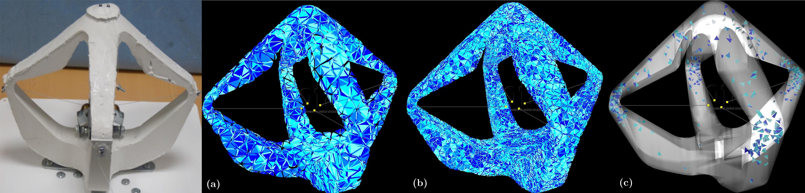
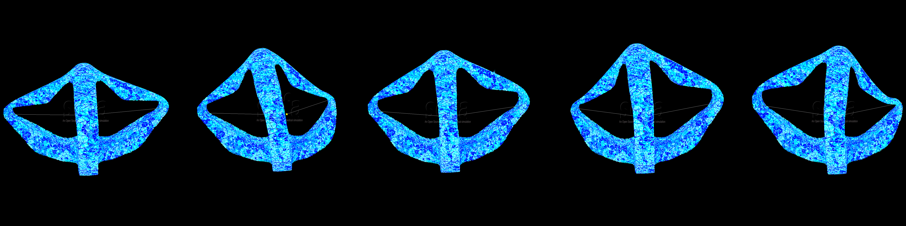
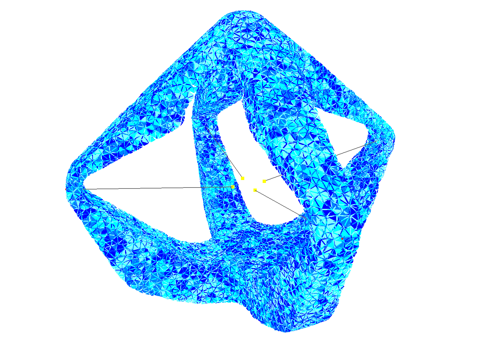
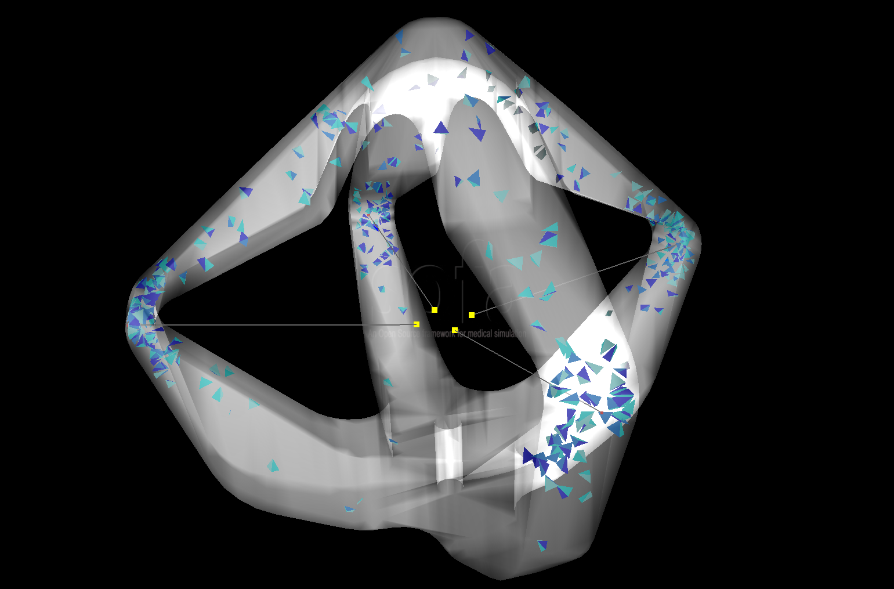

# Cable-driven Soft Robot



## Presentation

The Cable-driven Soft Robot is a proof of concept for the DEFROST team showing control of soft robots using SOFA simulation. There are several papers which have been written using it: [link](https://team.inria.fr/defrost/control-algorithms/). More recently it was reduced using this plugin: [link](https://hal.inria.fr/hal-01834483). 

**Brief description :**

The robot is entirely made of soft silicone and is actuated by four cables controlled by 
step motors located at its center. Pulling on the cables has the effect of lifting the effector located on top of the robot.
The “game” with this robot is to control the position of the effector by pulling on the cables.

*Little video of presentation showing it in action*

<iframe width="560" height="315" src="https://www.youtube.com/embed/BAUXKu6yX9A" frameborder="0" allowfullscreen="allowfullscreen"></iframe><br/><br/>


**Why reduce it :**

Previously the robot was controlled through real-time finite element simulation based on a mesh of 1628 nodes and 4147 tetrahedra.
That size of mesh was manageable in real-time on a standard desktop computer.
The simulation made using this underlying mesh was accurate enough to control the robot, only considering the displacement of the effector point,
located on the top of the robot and with a limited range on the pulling of the cable actuators. 

However, this does not show that the actual position of each of the four arms of the robot was accurately predicted for example.
When considering an application where the robot arms may enter in contact with the environment, an accurate prediction of their position becomes relevant.

To have this accuracy we need a much more finer mesh which will demand some intensive calculations and in the process we will lose the real-time simulation of it. So here comes our plugin to resolve this issue.

## Reduction Parameters

To reduce this robot we will use the defaultShaking(link!) function to shake it because we just need for actuators to perform simple incrementation along there working interval (here *[0 .. 40]* with an increment of *5*)

After that with a raisonnable tolerance (here *0.001*) we will select different modes, here some possible modes selected :



With these different parameters we will after perform the reduction like explained {doc}`here </usage/howToUse/howToReduce_script>`

## Results 

exemple results with a fine mesh:

**Before**



**After**



For more details about the results, displacmeent error comparison, test with different mesh and other, you can read the paper affiliated with this plugin{footcite:ps}`Goury2018`.

```{footbibliography}
```