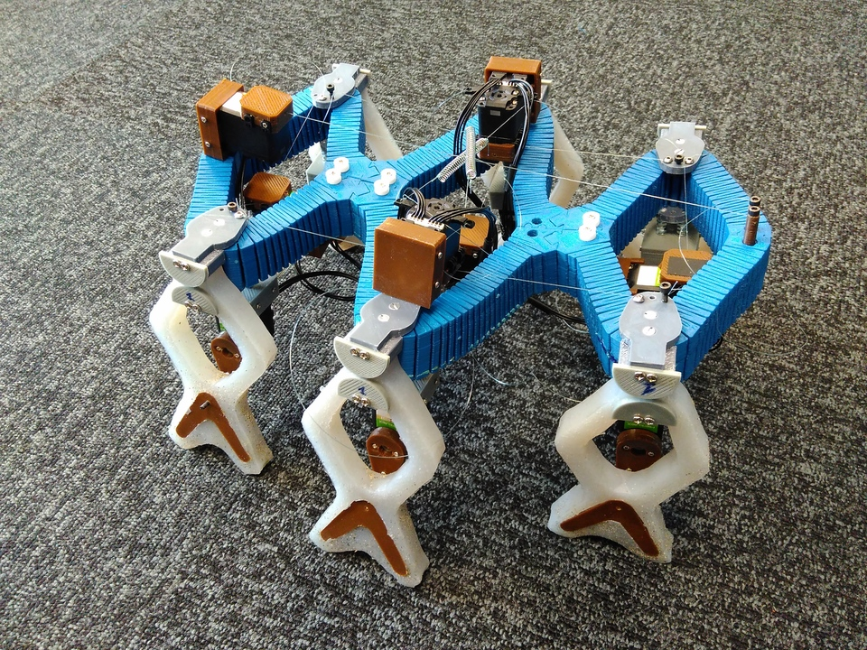
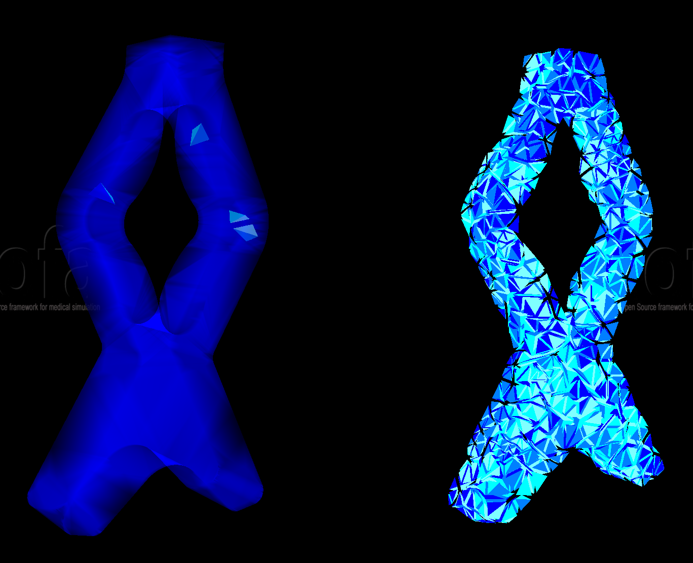
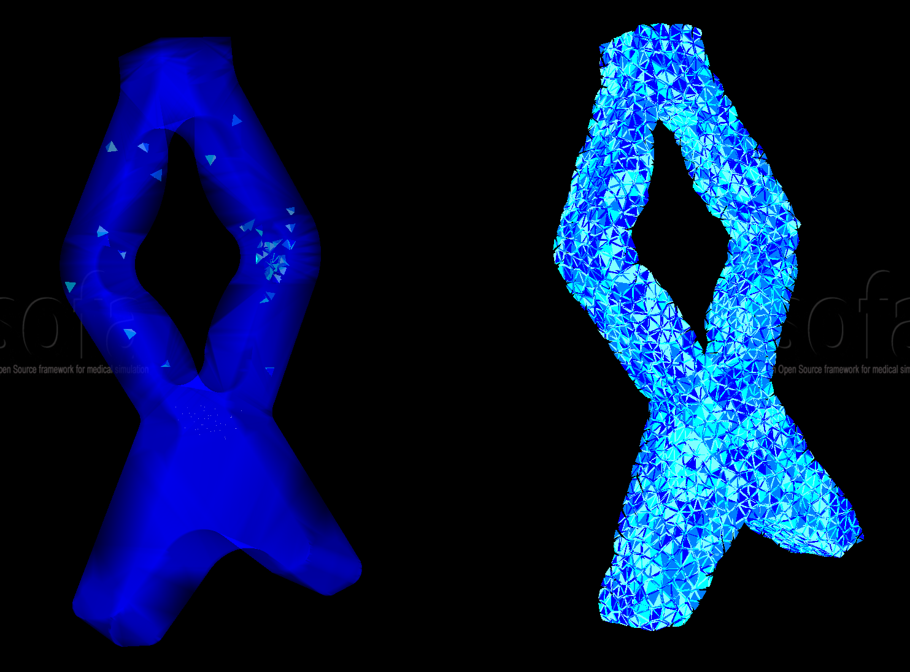

# 6-legged Robot



## Presentation

**Brief description :**

This robot has 6 legs actuated independently by 6 motors, which allows it to have various kind of movements.
 
*presentation video of the simulation showing it in action:*

<iframe width="560" height="315" src="https://www.youtube.com/embed/iQbSaFNWkAE" frameborder="0" allow="autoplay; encrypted-media" allowfullscreen></iframe>
	
---

*video of the realisation based on the previous simulation:*

<iframe width="560" height="315" src="https://www.youtube.com/embed/ZoPqL80fZ10" frameborder="0" allow="autoplay; encrypted-media" allowfullscreen></iframe>


**Why reduce it :**

To show that we can easily reduce parts of a soft robot and re-use it in the full robot.
Here we only reduce the leg of our robot not its core. 

## Reduction Parameters

To make a reduced model of one leg of this robot, we had to create a new special function to explore its workspace.
To create the rotation mouvement we see on the different previous videos we rotate a point that will be followed by the model creating the rotation.

:meth:`mor.animation.doingCircle` how it was implemented

We have only one actuator here, so our *listObjToAnimate* contains only one object:

	ObjToAnimate("actuator","doingCircle",'MechanicalObject',incr=0.05,incrPeriod=3,rangeOfAction=6.4,dataToWorkOn="position",angle=0,rodRadius=0.7)

With these different parameters we will after perform the reduction like explained {doc}`here </usage/tutorial/modelOrderReduction>`


## Results 

**With coarse mesh**



```{list-table} FPS before/after reduction 
:header-rows: 1
:name: perf_comparison_coarse

* - not reduced
  - reduced
* - 90
  - 300
```

---


**With fine mesh**



```{list-table} FPS before/after reduction 
:header-rows: 1
:name: perf_comparison_fine

* - not reduced
  - reduced
* - 3.8
  - 190
```
