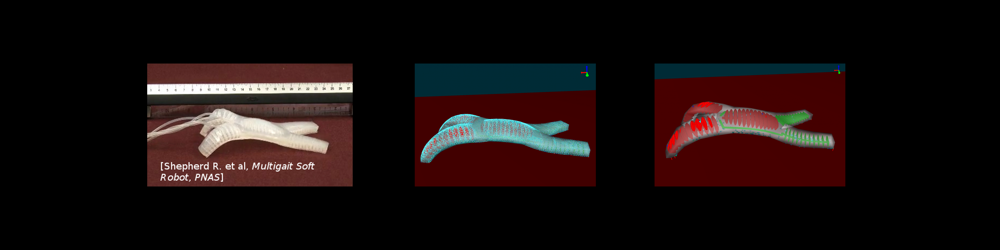
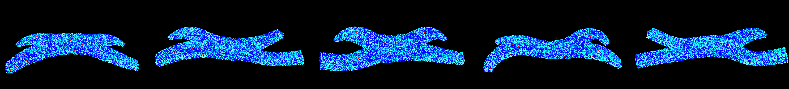
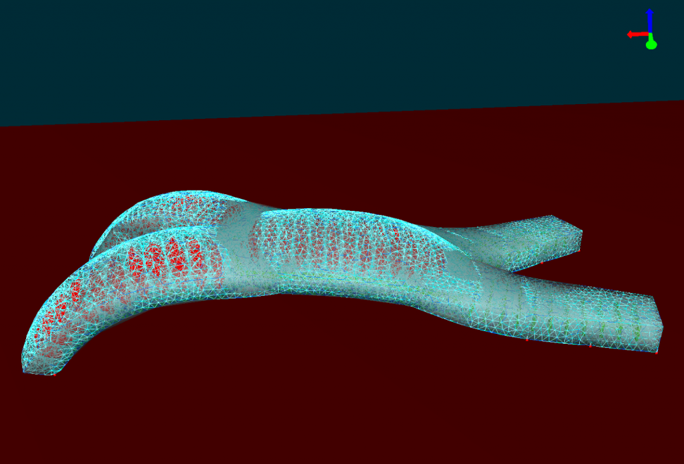
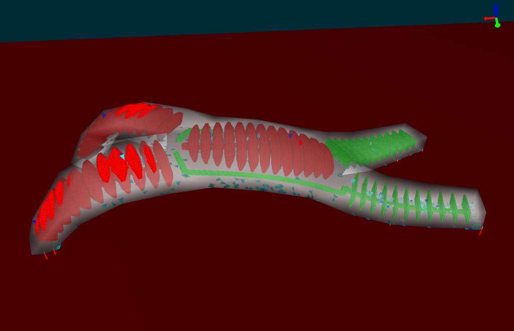

# Multigait Soft Robot

## Presentation

The multigait soft robot is a pneumatic robot from the work of R. Shepherd et. al, described here : [paper link](http://www.pnas.org/content/108/51/20400)

**Brief description :**

This robot is made of two layers:
one thick layer of soft silicone containing the cavities, and one stiffer and thiner layer of Polydimethylsiloxane
(PDMS) that can bend easily but does not elongate. The robot is actuated by five air cavities that can be actuated
independently. The effect of inflating each cavity is to create a motion of bending. Then, by actuating with
various sequences each cavities, the robot can move along the floor.

<iframe width="560" height="315" src="https://www.youtube.com/embed/QpnLj-rzjIo" frameborder="0" allowfullscreen="allowfullscreen"></iframe>  

**Why reduce it :**

The simulation of this crawling robot has to be really precise in order to simulate properly the differents deformations and the contact with the floor has showned in the previous video.

This needs of precision results with heavy calculations when the simulation is running preventing the fluidity of it, by reducing it we will be able to resolve this issue and also show 
that we the reduce model can move and handle contact in comparison with the previous example {doc}`Diamond Robot </usage/examples/Diamond/diamond>` that was fixed.

## Reduction Parameters

To reduce this robot we will use the defaultShaking(link!) function to shake it because we just need for actuators to perform simple incrementation along there working interval (here *[0 .. 2000 or 3500]* with an increment of *200 or 350*)

After that with a raisonnable tolerance (here *0.001*) we will select different modes, here some possible modes selected :

With these different parameters we will after perform the reduction like explained {doc}`here </usage/tutorial/modelOrderReduction>`.

## Results 

exemple results with a fine mesh:

**Before**

**After**

For more details about the results, displacement error comparison, test with different mesh and other, you can read the paper affiliated with this plugin [here](https://hal.inria.fr/hal-01834483)