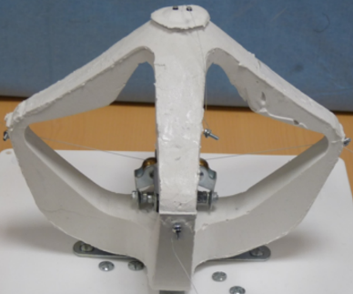
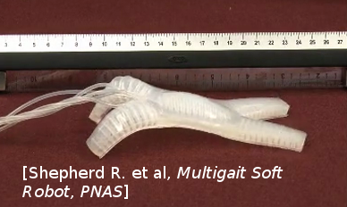

# Model Order Reduction Example

## Introduction <a name="introduction"></a>
***

In this python notebook exemple we will see with 2 real examples how to reduce a model from one of your sofa scene thanks to the **Model Order Reduction** plugin done by the INRIA research team **Defrost**.

the two examples will be :

- **[A cable-driven silicone robot](https://modelorderreduction.readthedocs.io/en/latest/usage/examples/Diamond/diamond.html)** (*paper link : [C. Duriez, ICRA, 2013](https://hal.archives-ouvertes.fr/hal-00823766/document)*).



- **[A pneumatic Soft Robot](https://modelorderreduction.readthedocs.io/en/latest/usage/examples/Starfish/starfish.html)** (*paper link : Multigait soft Robot [R.F. Shepherd et al, PNAS, 2011](http://www.pnas.org/content/108/51/20400)*).



After these expample presentation we can now proceed to the reduction.
First we have to prepare it by setting a bunch of parameters while explaining there purpose (here the parameters will be set twice, one for the diamond and one for the starfish so you will be able to switch easily between each example) 

## User Paramters <a name="User Paramters"></a> 
***

Before defining the reduction parameters, here are some "import" commands that will be useful for this python notebook:


```python
# Import
import os
import sys

sys.path.append(os.getcwd()+'/../python')

# MOR IMPORT
from mor.gui import utility
from mor.reduction import ReduceModel
from mor.reduction import ObjToAnimate
```

### 1.  Paths to the SOFA scene, mesh and outputs: <a name="Important Path"></a> 
 - The scene you want to work on
 - The folder containing its mesh
 - The folder where you want the results to be put in


```python
# Important path
from PyQt4 import QtCore, QtGui
app = QtGui.QApplication(sys.argv)

originalScene = utility.openFileName('Select the SOFA scene you want to reduce')
meshes = utility.openFilesNames('Select the meshes & visual of your scene')
outputDir = utility.openDirName('Select the directory tha will contain all the results')

# if you haven't install PyQt the previous function won't work
# As an alternative you can enter the absolute path to the conresponding files directly:
# originalScene = /PathToMy/Original/Scene
```

### 2.  The different reduction parameters <a name="Reduction Parameters"></a>

#### nodesToReduce <a name="nodesToReduce"></a>
- *ie : list containing the SOFA path from the rootnode to the model you want to reduce
        


```python
nodesToReduce_DIAMOND = ['/modelNode']
nodesToReduce_STARFISH =['/model']
```

#### listObjToAnimate <a name="listObjToAnimate"></a>
   
Contain a list of object from the class [ObjToAnimate](https://modelorderreduction.readthedocs.io/en/latest/_autosummary/_autosummary/_autosummary/mor.reduction.reduceModel.ObjToAnimate.html).
        
A ObjToAnimate will define an object to "animate" during the shaking.

There are 3 main parameter to this object :
- location : Path to obj/node we want to animate
- animFct : the animation function we will use (here we use [defaultShaking](https://modelorderreduction.readthedocs.io/en/latest/_autosummary/_autosummary/mor.animation.defaultShaking.html))
- all the argument that will be passed to the animFct we have chose
        
For example here we want to animate the node named "nord", but we won't specify the animFct so the default animation function will be used and be applied on the first default object it will find. The default function will need 3 additionnal parameters :
- incrPeriod (float):   Period between each increment
- incr (float):    Value of each increment
- rangeOfAction (float):    Until which value the data will increase
            
nord = ObjToAnimate("nord", incr=5,incrPeriod=10,rangeOfAction=40)


```python
# animation parameters

### CABLE-DRIVEN PARALLEL ROBOT PARAMETERS
nodesToReduce = ['/modelNode']
nord = ObjToAnimate("modelNode/nord", incr=5,incrPeriod=10,rangeOfAction=40)
sud = ObjToAnimate("modelNode/sud", incr=5,incrPeriod=10,rangeOfAction=40)
est = ObjToAnimate("modelNode/est", incr=5,incrPeriod=10,rangeOfAction=40)
ouest = ObjToAnimate("modelNode/ouest", incr=5,incrPeriod=10,rangeOfAction=40)
listObjToAnimate_DIAMOND = [nord,ouest,sud,est]

### MULTIGAIT SOFT ROBOT PARAMETERS
centerCavity = ObjToAnimate("model/centerCavity", incr=350,incrPeriod=2,rangeOfAction=3500)
rearLeftCavity = ObjToAnimate("model/rearLeftCavity", incr=200,incrPeriod=2,rangeOfAction=2000)
rearRightCavity = ObjToAnimate("model/rearRightCavity", incr=200,incrPeriod=2,rangeOfAction=2000)
frontLeftCavity = ObjToAnimate("model/frontLeftCavity", incr=200,incrPeriod=2,rangeOfAction=2000)
frontRightCavity = ObjToAnimate("model/frontRightCavity", incr=200,incrPeriod=2,rangeOfAction=2000)
listObjToAnimate_STARFISH = [centerCavity,rearLeftCavity,rearRightCavity,frontLeftCavity,frontRightCavity]
```

#### Modes parameters <a name="Modes parameters"></a>

- addRigidBodyModes (Defines if our reduce model will be able to translate along the x, y , z directions)
- tolModes ( Defines the level of accuracy we want to select the reduced basis modes)  


```python
addRigidBodyModes_DIAMOND = [0,0,0]
addRigidBodyModes_STARFISH = [1,1,1]

tolModes = 0.001
```

- tolGIE
    - *tolerance used in the greedy algorithm selecting the reduced integration domain(RID). Values are between 0 and 0.1 . High values will lead to RIDs with very few elements, while values approaching 0 will lead to large RIDs.  Typically set to 0.05.* 


```python
# Tolerance
tolGIE =  0.05
```

### 3 -- Optional parameters <a name="Optionnal Parameters"></a>


```python
# Optionnal
verbose = False
nbrCPU = 4
packageName = 'test'
addToLib = False
```

We can now execute one of the reduction we choose with all these parameters

## Execution <a name="Execution"></a>
***


### Initialization

The execution is done with an object from the class *[ReduceModel](https://modelorderreduction.readthedocs.io/en/latest/_autosummary/_autosummary/_autosummary/mor.reduction.reduceModel.ReduceModel.html#mor.reduction.reduceModel.ReduceModel)*.
we initialize it with all the previous argument either for the Diamond or Starfish example


```python
# Initialization of our script
nodesToReduce = nodesToReduce_DIAMOND # nodesToReduce_STARFISH
listObjToAnimate = listObjToAnimate_DIAMOND # listObjToAnimate_STARFISH
addRigidBodyModes = addRigidBodyModes_DIAMOND # addRigidBodyModes_STARFISH

reduceMyModel = ReduceModel(    originalScene,  
                                nodesToReduce,
                                listObjToAnimate,
                                tolModes,tolGIE,
                                outputDir,
                                meshes = meshes,
                                packageName = packageName,
                                addToLib = addToLib,
                                verbose = verbose,
                                addRigidBodyModes = addRigidBodyModes)
```

We can finally perform the actual reduction. here is a schematic to resume the differents steps we will perform : 


### Phase 1 <a name="Phase 1"></a> 
*[doc](https://modelorderreduction.readthedocs.io/en/latest/_autosummary/_autosummary/_autosummary/mor.reduction.reduceModel.ReduceModel.html#mor.reduction.reduceModel.ReduceModel.phase1)*

We modify the original scene to do the first step of MOR :   
- We add animation to each actuators we want for our model 
- And add a writeState componant to save the shaking resulting states  


```python
reduceMyModel.phase1()
```

### Phase 2 <a name="Phase 2"></a>

*[doc](https://modelorderreduction.readthedocs.io/en/latest/_autosummary/_autosummary/_autosummary/mor.reduction.reduceModel.ReduceModel.html#mor.reduction.reduceModel.ReduceModel.phase2)*

With the previous result we combine all the generated state files into one to be able to extract from it the different mode


```python
reduceMyModel.phase2()
```


```python
# Plot result
with open(reduceMyModel.packageBuilder.debugDir+'Sdata.txt') as f:
    content = f.readlines()
    
content = [x.strip() for x in content]

data = [go.Bar(x=range(1, len(content)+1),
            y=content)]

iplot(data, filename='jupyter/basic_bar')
```


```python
print("Maximum number of Modes : ")
reduceMyModel.reductionParam.nbrOfModes
```

### Phase 3 <a name="Phase 3"></a>

*[doc](https://modelorderreduction.readthedocs.io/en/latest/_autosummary/_autosummary/_autosummary/mor.reduction.reduceModel.ReduceModel.html#mor.reduction.reduceModel.ReduceModel.phase3)*

We launch again a set of sofa scene with the sofa launcher with the same previous arguments but with a different scene

This scene take the previous one and add the model order reduction component:
- HyperReducedFEMForceField
- MappedMatrixForceFieldAndMass
- ModelOrderReductionMapping and produce an Hyper Reduced description of the model


```python
reduceMyModel.phase3()
```

### Phase 4 <a name="Phase 4"></a>

*[doc](https://modelorderreduction.readthedocs.io/en/latest/_autosummary/_autosummary/_autosummary/mor.reduction.reduceModel.ReduceModel.html#mor.reduction.reduceModel.ReduceModel.phase4)*

Final step : we gather again all the results of the previous scenes into one and then compute the RID and Weigts with it. Additionnally we also compute the Active Nodes


```python
reducedScene = reduceMyModel.phase4()
```

End of example you can now go test the results in the folder you have designed at the beginning of this tutorial

## To go Further <a name="To go Further"></a>
***

Links to additional information about the plugin:

**[Publication in IEEE Transactions On Robotics](https://hal.inria.fr/hal-01834483)**

**[Plugin website](https://project.inria.fr/modelorderreduction/)**

**[Plugin doc](https://modelorderreduction.readthedocs.io/en/latest/index.html)**